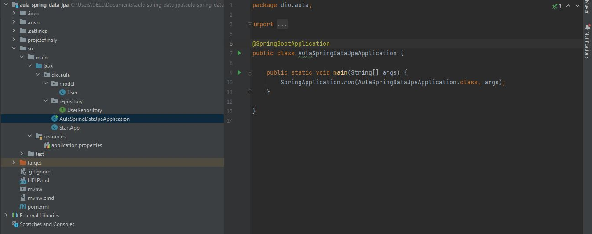
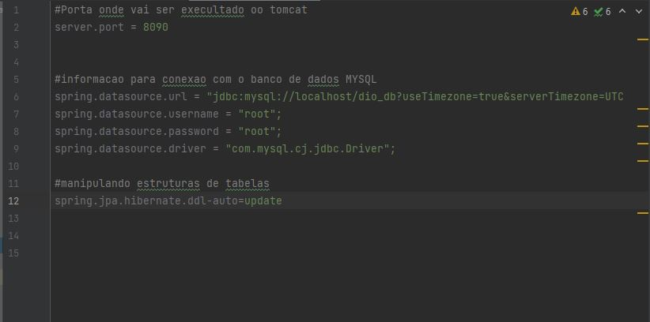
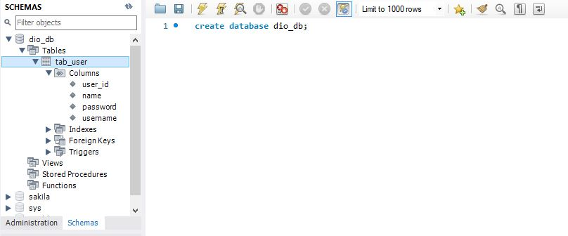

# Spring-Framework-com-Spring-Boot📚

### Criando um projetinho simples mas que aborda quases todos recursos essenciais para qualquer aplicaçao , abordado tambem a exploraçao  de inversão de controlhe e injeçao de dependencia que e o core do framework spring:
 

### Uma interacão simples com o  banco de dados : 
 

### Banco  de dados :
 

Videos disponiveis na platarforma <a href="https://web.dio.me/course/imersao-no-spring-framework-com-spring-boot/learning/76dae2f8-07b8-4801-b66a-cdc38209ab87?back=/track/carrefour-web-developer&tab=undefined&moduleId=undefined">Digital innovation one  </a>👨‍👨‍💻

